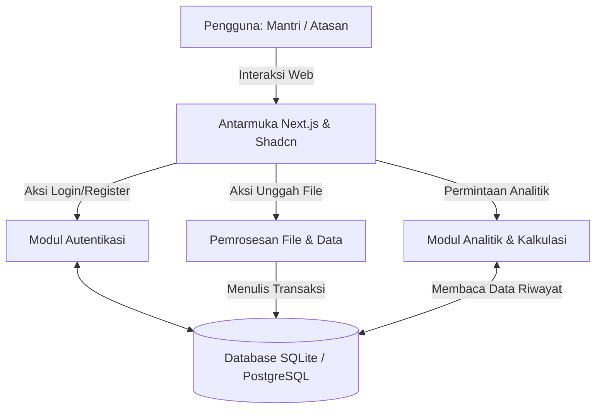
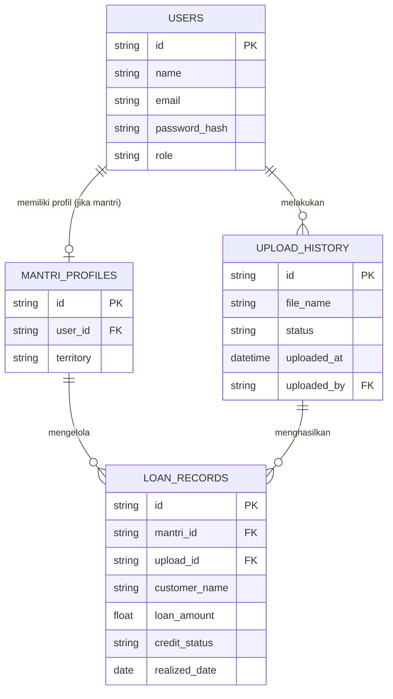

# PRD — Project Requirements Document

## 1. Overview
Aplikasi ini adalah dasbor analitik berbasis web yang dirancang khusus untuk memonitor kinerja mantri (petugas pinjaman) dan kualitas kredit nasabah. Masalah utama yang diselesaikan adalah kesulitan dalam melihat rekapitulasi data riwayat pinjaman historis (time-series) secara cepat dan akurat. Dengan aplikasi ini, atasan dan mantri dapat mengunggah file data riwayat pinjaman nasabah, yang kemudian akan divisualisasikan menjadi grafik produksi pinjaman baru dan indikator kesehatan kredit. Tujuannya adalah untuk mempermudah pemantauan kinerja, pengambilan keputusan, dan evaluasi portofolio kredit secara praktis dan otomatis.

## 2. Requirements
- **Manajemen Akses (Role-based Access):** Sistem harus bisa digunakan oleh Mantri dan Atasan langsung dengan tingkat akses yang informatif.
- **Pemrosesan File:** Kemampuan untuk menerima dan memproses data riwayat pinjaman melalui unggahan file (seperti CSV atau Excel).
- **Visualisasi Data Dinamis:** Sistem harus mampu mengubah data mentah yang diunggah menjadi grafik dan ringkasan yang mudah dipahami.
- **Filter Waktu (Time-series):** Seluruh laporan dan grafik harus mendukung penyaringan (filtering) berdasarkan rentang waktu tertentu.
- **Dukungan Kinerja:** Sistem harus responsif, ramah bagi pengguna non-teknis, dan memproses perhitungan metrik kredit (persentase lancar/macet) secara otomatis dari data terbaru.

## 3. Core Features
Fitur-fitur berikut diurutkan berdasarkan fase pengembangan (Roadmap):

### Fase 1: Visualisasi Dasar & Laporan
- **Dasbor Ringkasan** — Menampilkan rekap keseluruhan produksi pinjaman baru dan kualitas kredit per mantri.
  - **Grafik Produksi Mantri:** Grafik batang/garis yang divisualisasikan untuk melihat jumlah pinjaman baru yang direalisasikan tiap mantri.
  - **Indikator Kualitas Kredit:** Menunjukkan tingkat kesehatan kredit (misal: persentase kredit lancar dibandingkan yang macet).
  - **Filter Periode Waktu:** Memungkinkan pengguna memilih rentang tanggal tertentu agar data yang ditampilkan lebih relevan.
  - **Ringkasan Rekap:** Kartu (card) ringkasan yang menyorot angka total pinjaman baru dan rata-rata kualitas keseluruhan.

### Fase 2: Input Data & Detail Mendalam
- **Unggah Data** — Mengunggah file data riwayat pinjaman nasabah ke dalam sistem.
  - **Pilih & Unggah File:** Memungkinkan pengguna memilih file dari perangkat dan mengirimkannya secara aman ke aplikasi.
  - **Status Proses:** Memberi tahu pengguna status dokumen (sedang diproses, berhasil, atau gagal diimpor).
  - **Riwayat Unggahan:** Menampilkan daftar file yang pernah diunggah beserta tanggal modifikasi dan status keberhasilannya.
- **Detail Kinerja Mantri** — Melihat informasi lengkap produksi dan kualitas pinjaman difokuskan pada satu mantri tertentu.
  - **Profil Mantri:** Memuat daftar mantri lengkap beserta detail nama dan wilayah kerjanya.
  - **Grafik Kinerja Individu:** Menampilkan tren produksi pinjaman khusus untuk mantri yang dipilih.
  - **Riwayat Pinjaman:** Tabel komprehensif berisi semua daftar pinjaman yang dikelola sang mantri beserta status kelancaran kreditnya.

### Fase 3: Akses & Keamanan
- **Autentikasi** — Mengamankan akses dengan akun pribadi bagi mantri dan atasan.
  - **Daftar Akun:** Pendaftaran akun pengguna baru menggunakan formulir email dan kata sandi.
  - **Login:** Autentikasi masuk ke akun yang sudah terdaftar.
  - **Logout:** Mengakhiri sesi dan keluar dari akun yang sedang aktif.
  - **Lupa Kata Sandi:** Proses mengatur ulang kata sandi dengan verifikasi jika pengguna lupa.
- **Pengaturan Akun** — Mengelola informasi profil dan keamanan akun pengguna pribadi.
  - **Ubah Profil:** Fitur memperbarui informasi dasar seperti nama, email, atau penambahan data diri lainnya.
  - **Ubah Kata Sandi:** Mengganti kata sandi aktif untuk menjaga tingkat keamanan akun tetap optimal.

## 4. User Flow
Berikut adalah gambaran langkah-langkah perjalanan pengguna di dalam aplikasi:
1. **Akses & Login:** Pengguna (Atasan/Mantri) membuka aplikasi dan melakukan Login (atau mendaftar jika belum memiliki akun).
2. **Unggah Data Tersentralisasi:** Atasan masuk ke menu "Unggah Data", memilih file riwayat pinjaman (Excel/CSV), dan menekan unggah. Sistem akan memproses file tersebut hingga statusnya "Berhasil".
3. **Memonitor Dasbor Ringkasan:** Pengguna menuju halaman Utama (Dasbor) dan melihat kartu rekapitulasi. Pengguna menggunakan 'Filter Periode Waktu' untuk meninjau data per bulan tertentu.
4. **Menganalisis Grafik:** Pengguna melihat grafik produksi tiap mantri dan persentase indikator kualitas kredit per wilayah secara langsung.
5. **Melihat Detail:** Atasan mengklik salah satu nama mantri pada peringkat/laporan untuk masuk ke "Detail Kinerja Mantri", melihat profil, riwayat klien yang ditangani, dan grafik kinerjanya.
6. **Keluar/Log Out:** Setelah selesai mengawasi dan menganalisa, pengguna dapat mengatur profil mereka atau melakukan logout.

## 5. Architecture
Aplikasi ini akan menggunakan arsitektur aplikasi web modern (Client-Server) di mana sisi Front-end dan Back-end terintegrasi di dalam satu framework. File yang diunggah akan diproses oleh Back-end untuk dipecah (parsing) menjadi entri database, lalu dirender ke dalam komponen grafik (Front-end).

## 6. Database Schema
Untuk menyimpan struktur sistem analitik dan pengguna, berikut adalah panduan skema tabel database yang dibutuhkan:

- **Users:** Menyimpan data pengguna (Atasan atau Mantri yang punya hak akses login).
  - `id` (String/UUID) - Identifier unik pengguna.
  - `name` (String) - Nama pengguna.
  - `email` (String) - Email pengguna.
  - `password_hash` (String) - Kata sandi yang sudah dienkripsi.
  - `role` (String) - Peran (`atasan` atau `mantri`).
- **MantriProfiles:** Menyimpan info profil tambahan para mantri (bisa berisi target produksi atau wilayah kerja).
  - `id` (String/UUID) - Identifier mantri.
  - `user_id` (String/UUID) - Relasi ke tabel `Users` (Opsional jika mantri tersebut bisa login).
  - `territory` (String) - Wilayah operasional.
- **UploadHistory:** Mencatat detail setiap file yang diimpor ke sistem.
  - `id` (String/UUID) - Identifier proses unggahan.
  - `file_name` (String) - Nama file asal.
  - `status` (String) - Mis. `pending`, `success`, `failed`.
  - `uploaded_at` (Datetime) - Kapan file dikirim.
  - `uploaded_by` (String/UUID) - ID Pengguna yang mengunggah.
- **LoanRecords:** Tabel time-series yang berisi transkrip riwayat kredit yang diunggah.
  - `id` (String/UUID) - Identifier unik pinjaman.
  - `mantri_id` (String/UUID) - Mengaitkan pinjaman dengan mantri tertentu.
  - `upload_id` (String/UUID) - Relasi ke sesi file unggahan (batch pengunggahan).
  - `customer_name` (String) - Nama nasabah (opsional untuk kerahasiaan, bisa disamarkan).
  - `loan_amount` (Decimal) - Total produksi / besaran pinjaman rill.
  - `credit_status` (String) - Skala kesehatan kredit (mis. `lancar`, `DPK`, `macet`).
  - `realized_date` (Date) - Tanggal transaksi direalisasikan.

## 7. Tech Stack
Berikut adalah rekomendasi teknologi untuk pengembangan aplikasi ini dengan fokus pada kecepatan pengembangan, skalabilitas, dan reabilitas visual:
- **Frontend & Backend (Full-stack Framework):** Next.js (berbasis React) — Untuk pembuatan interaksi UI sekaligus modul pemrosesan file (API Routes).
- **Desain & UI Components:** Tailwind CSS & shadcn/ui — Memberikan tampilan dasbor yang bersih dan korporat secara instan (mengandung komponen chart bawaan populer seperti Recharts).
- **Alat Database (ORM):** Drizzle ORM — Sangat responsif dan statis untuk membantu query yang berat untuk kebutuhan analitik.
- **Sistem Database:** SQLite — (Sebagai permulaan dan ringan) atau PostgreSQL bila data pinjaman (time-series) diperkirakan mencapai jutaan baris dalam sekian bulan.
- **Autentikasi:** Better Auth — Solusi manajemen user/login yang aman, mendukung sistem RBAC (Role-based access).